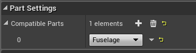

This document will outline the usage, design and structure of the ship building demo.

# Controls
This section will go over the controls for the demo.

### Camera
* Scrolling up/down will move the camera up/down.
* Holding shift then scrolling will zoom the camera in/out.
* Holding right click and moving the mouse will orbit the camera around the building area.

### Ship Parts
* Holding Left click on a ship part and moving the mouse will move the ship part around.
* Pressing Delete while holding a ship part will delete it.

### Creating Ship Parts
To create a ship part, select the category of the part you'd like to create from the top left, then select the part you'd like to make. The part will spawn in the center, so if there's an existing part there already it will be underneath it.

### Snapping Parts
When you select a ship part (click and hold), any attach points the part has that are compatible with points of other ship parts will appear green. You can snap two compatible points together by dragging the part over to the other one. Once they are close enough they should automatically snap into place.
To un-snap parts just select the part and drag it away from the other ones.

### Saving/Loading Ships
To save your current ship, click the save button in the bottom right corner of the UI. An input dialogue will pop up and ask you to enter the name of the ship.
NOTE: There currently isn't any validity checks or checks if the filename already exists so using the same name will overwrite any existing one with the same name.

To load a ship, click the load button in the bottom right corner of the UI. A dialogue will pop up with a grid containing buttons with the names of all the saved ships. Click the button for the one you wish to load.

NOTE: A lot of the UI is super basic and most of it is placeholder for the sake of the demo, so it will obviously lack many features and aesthetic.

---

# Overview
This section will go over the general outline of how the project is structured and functions.

This project is set up with the idea that the ship building and actual gameplay parts are two separate game modes. As such there is a separate game mode, controller, pawn etc. specifically for the ship building. These are all prefixed with `ShipEditor` in the file/class name, and are located in the ShipEditor folder.

## Directory Structure
* **Source**- Root source directory.
** **ShipBuildingDemo** - Root project source files dir.
*** **GameCore** - Core files (game mode, controller, pawn) for regular gameplay (default ship template game).
*** **Serialization** - Classes related to the saving/loading of the ships.
*** **ShipBuilding** - Main classes for the ship parts, attach points and types.
*** **ShipEditor** - Core gameplay classes for the ship building game mode.
* **Content** - Project content root.
** **ShipParts** - The root folder for all ship parts. __Ship parts **must** be placed in a sub folder named after the type they are.__

---
## Class Overview
This section will give a summary on what each of the main classes is for.

### ShipEditor Classes
* **ShipEditorGameMode** - GameMode class for the ship editor. Just sets the default classes.
* **ShipEditorPlayerController** - The main class responsible for handling user input and invoking the appropriate action. It also acts as the interface for the blueprint UI to spawn, save and load ship parts. Ideally this would be encapsulated in a separate class, but the player controller works fine for this demo.
* **ShipEditorPawn** - This is the player pawn class for when in the ship editing game mode. This class just handles basic input for movement and manages the camera.
* **ShipEditorHUD** - Manages the main HUD widgets.

### ShipBuilding Classes
* **ShipPart** - Base class for all ship parts. This class is what the blueprints for new ship parts is based on. This manages it's attach points, static mesh, and part type.
* **ShipAttachPoint** - Represents a point on a ShipPart that other ShipParts can attach to. These are created as child components of a ShipPart and placed where the parts should attach. By default these will inherit the `DefaultCompatibleParts` of it's owning ShipPart at runtime, but you can override those directly on the attach point.
* **ShipBuildingTypes** - Holds the enum with all the ShipPart types. See below for how new ship parts are added.
* **ShipPartFactory** - Factory class for creating ship parts by name. This is owned by the `ShipEditorPlayerController` and also generates the data the UI uses to populate the ship part lists.

### Ship Serialization Classes
* **ShipRecords** - Holds the data structs for the data saved for different ship objects. Currently only contains the data struct for a ship part.
* **ShipSaveGame** - Represents the data that is saved/loaded to/from disk for a single ship.

----
# Ship Part Attachment Overview
This section will outline how ship parts attach to each other.

**Core concepts:**
* Each ship part has a `PartType` that corresponds to one of the categories defined in the `EPartType` enum in `ShipBuildingTypes.h`.
* A ship part can contain many `AttachPoint`s which define where the owning ship part can attach to other ship parts.
* An `AttachPoint` can describe which part types it is compatible with by the part types listed in its `CompatibleParts` array.

For a ship part to attach to another the following criteria must be met:
1. Part A must have an attach point that is compatible with part B's `PartType`, and that is not already attached to something.
2. Part B must have an attach point that is compatible with part A's `PartType`, and that is not already attached to something.

Based on this criteria there can be multiple attach points on each part that are compatible with each other. I have added another criteria filter that the normal of two possibly compatible points must be pointing in opposite directions. This is just because I am not rotating the pieces at all, so the parts must be able to maintain their existing rotation to snap together. This can be removed in the future depending on how it should function.

----
# Creating a Ship Part
1. Select the folder for the type of part you want to make. This will make it so the new blueprint is created in this folder.
2. Create a new blueprint based and set the parent class to `ShipPart`.
3. Rename the blueprint to have the "BLU_" prefix as required, then the rest of the part name. Note that the name after the prefix is what will appear in the UI.
4. Open the blueprint for the newly created ship part, then click the "Class Defaults" button in the toolbar.
5. In the details panel on the right you can set the part type (must match the folder the blueprint was created in). You can also set the default types that this parts attach points should be compatible with.

### Adding a mesh
1. Open the blueprint of the ship part.
2. In the component list on the left, click **Add Component** and select "Static Mesh".
3. Select the newly created static mesh component and set the mesh to whatever asset you want via the details panel on the right.

### Adding attach points
1. The initial steps are identical to adding a mesh, but instead of a static mesh component, create an `AttachPointComponent`.
2. If you haven't already, select the "Viewport" tab so you can see the visual representation of the part. In this view you can move the attach point around (after selecting the component in the components list on the left) and rotate it so the red arrow points in the direction that is opposite of the face it's nearest to.

# Adding a new ship part type
1. Add a new enum entry to `EPartType` in `ShipBuildingTypes.h`.
2. Add a new folder named the same as the enum (without the "PT_" prefix) in `Content/ShipParts`.